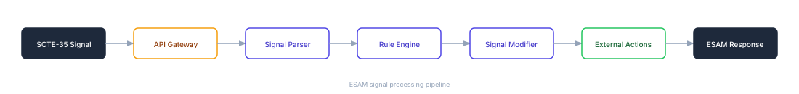
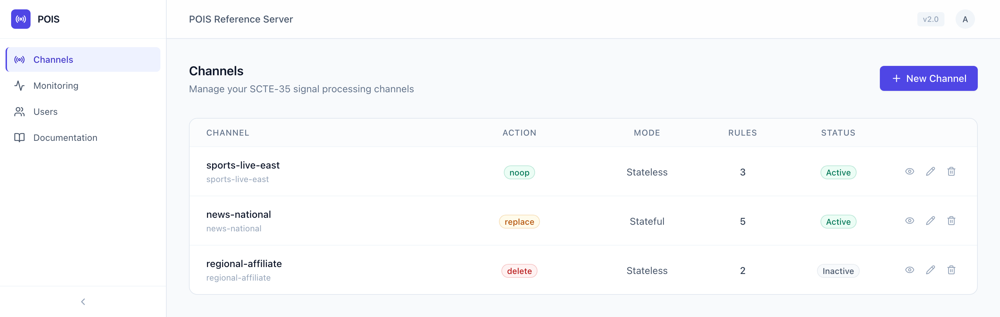
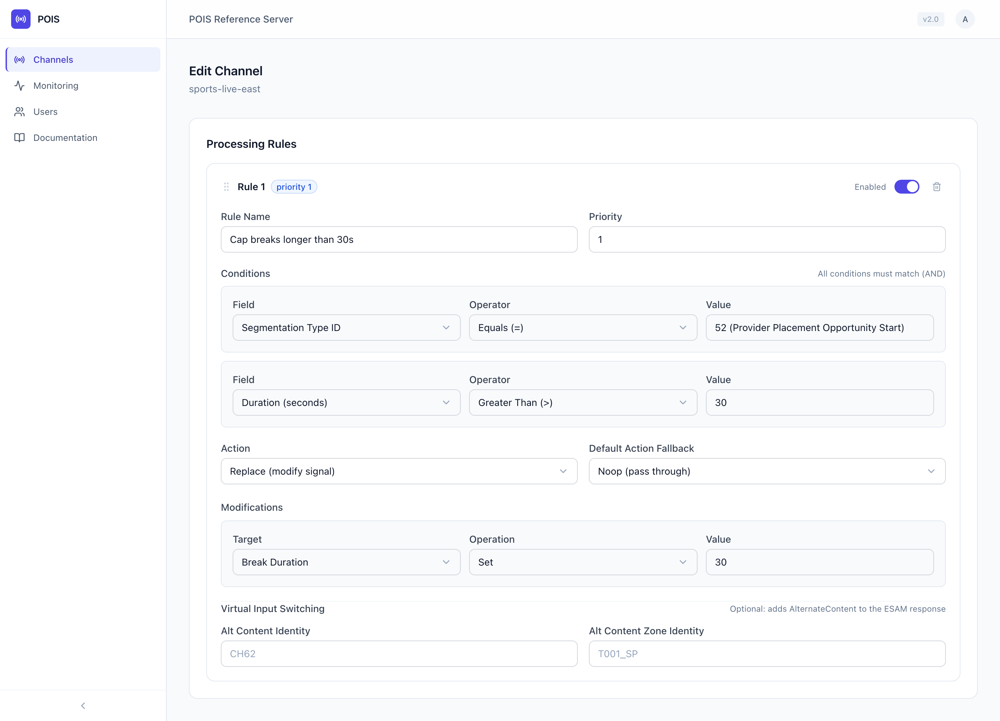
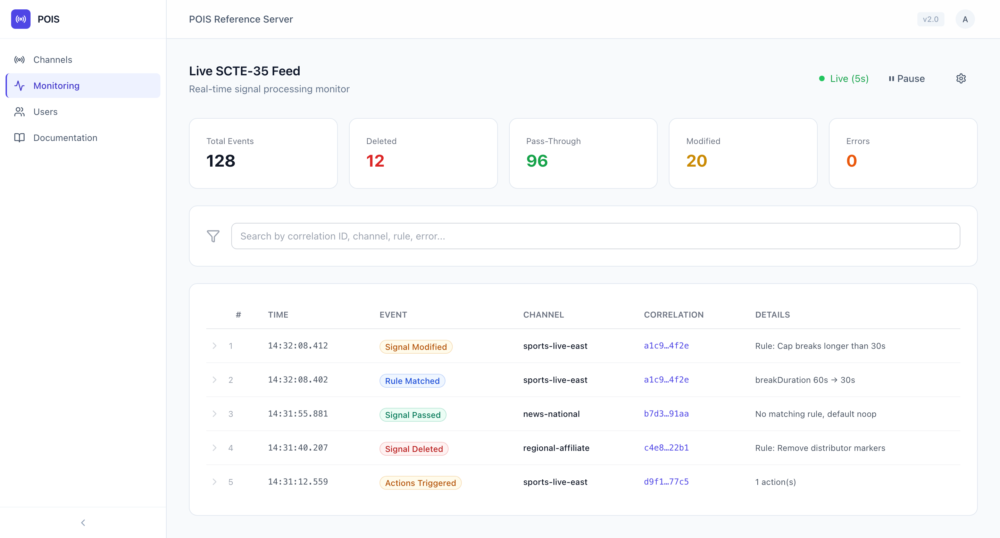

# POIS Reference Server

[](https://opensource.org/licenses/MIT-0)

## Description

The **Placement Opportunity Information Service (POIS) Reference Server** is a serverless reference implementation of the ESAM signal-conditioning exchange used for SCTE-35 processing in live video workflows.

A POIS answers conditioning requests from an encoder. This project implements the ESAM Signal Processing Event (SPE) and Signal Processing Notification (SPN) exchange defined in SCTE-130 Part 9: it receives SCTE-35 signals from an ESAM-capable encoder or stream processor, evaluates them against channel-specific rules, and returns a conditioning decision. The conditioned signal then flows downstream to systems such as packagers, AWS Elemental MediaTailor, or third-party SSAI platforms.

### What it does, in one example

An encoder acquires a SCTE-35 signal and asks the POIS what to do with it:

```text
Encoder sends (ESAM SignalProcessingEvent)
  segmentation_type_id = 0x34   (52, Provider Placement Opportunity Start)
  duration             = 60s
```

You configure a channel rule that caps long placement opportunities:

```text
IF   segmentationTypeId = 52  (0x34)
AND  duration > 30
THEN set segmentationDuration to 30
```

The POIS returns the conditioned signal in the same HTTP response:

```text
Encoder → ESAM SignalProcessingEvent → POIS → rule engine
       → ESAM SignalProcessingNotification (action "replace")
       → encoder emits SCTE-35 with a 30 second segmentation duration
```

The same rule match can also select an alternate input for AWS Elemental Live Virtual Input Switching, or invoke an external action such as a webhook or an AWS Elemental MediaLive schedule update.

This reference implementation is designed for broadcast engineers, streaming operators, and ad-tech teams who need to:

- Condition SCTE-35 signals before they reach downstream ad decision systems
- Apply business rules to control which placement opportunities are surfaced
- Modify supported signal fields and descriptors (segmentation type, duration, UPID) in the encoder request path
- Integrate signal processing with external systems via webhooks or MediaLive schedule actions

This project is a reference implementation for evaluation and development. Review and extend its security, reliability, and operational controls before using it for a production workload.

## Architecture

The project is organized into four components:

| Component | Path | Description |
|-----------|------|-------------|
| Backend | `backend/` | Python 3.12 Lambda functions for SCTE-35 processing, rule evaluation, and API logic |
| Frontend | `frontend/` | React 18 + TypeScript dashboard for channel management, rule configuration, and log inspection |
| Infrastructure | `infrastructure/` | AWS CDK (TypeScript) stacks defining all cloud resources |
| Documentation | `docs/` | Architecture diagrams, API specifications, and operational guides |

### Data Flow



**Core services:**

- **Amazon API Gateway**, RESTful API for ESAM signal processing and management endpoints
- **AWS Lambda**, Compute for signal parsing, rule evaluation, and signal modification
- **Amazon DynamoDB**, Storage for channel configuration, rules, break state, and action audit records
- **AWS Systems Manager Parameter Store**, SecureString storage for optional per-channel encoder credentials
- **Amazon Cognito**, Dashboard authentication and the `admin` and `user` groups
- **Amazon CloudWatch**, Monitoring, alarms, and structured logging
- **AWS X-Ray**, Request tracing for the API and Lambda functions

## Dashboard

The deployment includes a React dashboard for configuring channels and rules and for inspecting signal processing. The screens below use sample data.

The Channels page lists every configured channel with its default action, processing mode, rule count, and status. Administrators can create, edit, and delete channels from here.



Rules are configured per channel. Each rule combines its conditions with AND, selects a signal action, and can carry modifications, alternate content for virtual input switching, and external actions. This example caps placement opportunities longer than 30 seconds.



The monitoring page polls CloudWatch Logs and shows recent ESAM activity, with the matched rule, the action taken, and a correlation ID that links the entries of a single request.



The dashboard also provides channel details with the ESAM endpoint and encoder credentials, a SCTE-35 decoder, user management for administrators, and the full in-app documentation.

## Features

### SCTE-35 Processing

- SCTE-35 binary and base64 parsing via the threefive library
- Segmentation descriptor extraction and analysis
- Signal re-encoding after modification
- Rule matching and modification for the fields listed under [Configuring Rules](#configuring-rules), including provider and distributor placement opportunity types

### Rule Engine

- Channel-scoped rule definitions with priority ordering
- Conditional matching on command type, segmentation type, duration, UPID, zone identity, and the other fields listed under [Configuring Rules](#configuring-rules)
- First-match evaluation: rules are sorted by ascending priority, and the first rule whose conditions all match determines the action
- Descriptor priority setting that selects which segmentation descriptor supplies values during evaluation

### Signal Modification

- Add or remove segmentation descriptors
- Override duration, segmentation type ID, UPID values, and delivery restriction flags
- Conditional signal passthrough or suppression
- Splice insert and time signal handling

### External Actions

- AWS Elemental MediaLive schedule actions, including SCTE-35 insertion, input switching, input preparation, and graphics overlays
- Webhook notifications with configurable payloads
- Ordered execution with per-action timeouts, retries, idempotency windows, and an optional dry-run mode
- Actions run inside the ESAM request path: the SPN is returned after the configured actions finish, so action timeouts and retries add to encoder response time

MediaLive actions need permissions that are not granted by default. Either pass the target channel ARNs at deploy time, which grants `medialive:BatchUpdateSchedule` and `medialive:DescribeSchedule` scoped to those channels:

```bash
npx cdk deploy --all \
  -c adminEmail=you@example.com \
  -c mediaLiveChannelArns=arn:aws:medialive:us-east-1:111122223333:channel:1234567
```

Or configure explicit credentials on the action to target a channel in another account. Use the dashboard's dry-run mode to validate an action configuration before it makes real API calls.

### Stateful Mode

- Tracks whether a channel is currently inside an active break, across requests
- Detects break start and break end from splice insert out-of-network indicators and placement opportunity segmentation types
- Retains the break event ID and a calculated expiry time in DynamoDB, and suppresses further signals until a break end arrives or the expiry passes

### Authentication and RBAC

- Cognito User Pool integration with JWT validation at API Gateway
- Two roles: `admin` and `user`. Authenticated users can read channel configuration and logs; administrators change channels and rules, manage users, and manage encoder credentials
- Optional HTTP Basic Authentication for the `/esam` endpoint, configured per channel
- Structured logging of configuration changes and signal processing, plus DynamoDB audit records for external actions

## Prerequisites

- **AWS Account** with permissions to create Lambda, DynamoDB, API Gateway, Cognito, and IAM resources
- **Python 3.12+** with pip
- **Node.js 20+** with npm
- **AWS CDK CLI** v2 (`npm install -g aws-cdk`)
- **AWS CLI** v2, configured with valid credentials (`aws configure`)

## Deployment

### 1. Clone the repository

```bash
git clone https://github.com/aws-samples/sample-esam-pois-reference-server.git
cd sample-esam-pois-reference-server
```

### 2. Install backend dependencies

```bash
cd backend
python -m venv .venv
source .venv/bin/activate
pip install -r requirements-dev.txt
```

### 3. Install frontend dependencies

```bash
cd frontend
npm install
```

### 4. Install infrastructure dependencies

```bash
cd infrastructure
npm install
```

### 5. Bootstrap CDK (first time only)

```bash
npx cdk bootstrap aws://<ACCOUNT_ID>/<REGION>
```

### 6. Deploy all stacks

```bash
npx cdk deploy --all -c adminEmail=you@example.com
```

The `adminEmail` context value provisions the initial admin user: Cognito sends an invitation email with a temporary password to that address (self sign-up is disabled). If you omit it, no user is created and you must create one later with two commands, because dashboard administration requires membership in the `admin` group:

```bash
# 1. Create the account. Cognito emails a temporary password; EMAIL is stated
#    explicitly to match the deployment path, since the pool signs in with
#    email and stores no phone number.
aws cognito-idp admin-create-user \
  --user-pool-id <USER_POOL_ID> \
  --username you@example.com \
  --user-attributes Name=email,Value=you@example.com Name=email_verified,Value=true Name=name,Value=Administrator \
  --desired-delivery-mediums EMAIL

# 2. Grant administrator access. The handlers authorize writes from the
#    "cognito:groups" claim, so an account created by step 1 alone belongs to
#    no group: it can read channels and logs, but cannot change them, manage
#    users, or view encoder credentials.
aws cognito-idp admin-add-user-to-group \
  --user-pool-id <USER_POOL_ID> \
  --username you@example.com \
  --group-name admin
```

`<USER_POOL_ID>` is the `UserPoolId` output of the deployment. The account signs in with the temporary password and is then prompted to choose a permanent one.

CDK prompts for approval before creating IAM resources in each stack. To deploy non-interactively (CI or scripted deployments), add `--require-approval never`.

The deployment region follows your AWS CLI configuration. To deploy to a specific region, set `AWS_REGION` (for example, `AWS_REGION=us-west-2 npx cdk deploy --all -c adminEmail=you@example.com`).

Stacks are named `pois-reference-server-<env>-*`, where `<env>` defaults to `dev`. Pass `-c env=staging` or `-c env=prod` to deploy a different environment profile, which changes log retention, API throttling limits, and whether API Gateway data trace logging is enabled — see `infrastructure/lib/config/environment.ts`. Because the environment is part of every stack name, multiple environments can coexist in the same account and region.

No frontend configuration is needed: CloudFront serves the dashboard and proxies `/api/*` to API Gateway, and the dashboard fetches its Cognito configuration at runtime.

After deployment, CDK outputs the API Gateway URL, CloudFront distribution URL (frontend), and Cognito User Pool ID.

## API Reference

| Method | Endpoint | Description |
|--------|----------|-------------|
| POST | `/esam` | Process ESAM SignalProcessingEvent and return SignalProcessingNotification |
| GET | `/channels` | List all channels |
| POST | `/channels` | Create a channel (includes rules inline) |
| GET | `/channels/{id}` | Get channel details |
| PUT | `/channels/{id}` | Update a channel (including rules) |
| DELETE | `/channels/{id}` | Delete a channel |
| GET | `/logs` | Query processing logs |
| GET | `/auth/config` | Get Cognito configuration for frontend |

The `/esam` endpoint can require HTTP Basic Authentication with per-channel credentials generated through the dashboard. Basic Authentication is configured per channel and is disabled until you enable it. Management endpoints (`/channels`, `/logs`) require a valid Cognito JWT token in the `Authorization` header.

## Configuration

### Creating a Channel

A channel represents a video stream source with its own set of processing rules:

```json
{
  "channelId": "sports-live-east",
  "name": "sports-live-east",
  "description": "East region sports live feed",
  "enabled": true,
  "statefulMode": false,
  "defaultAction": "noop",
  "descriptorPriority": "52,34,48",
  "rules": []
}
```

### Configuring Rules

Rules define how signals are processed for a given channel. Rules are sorted by ascending `priority`, and the first rule whose conditions all match determines the action. Conditions inside a rule are combined with AND. If no rule matches, the channel's `defaultAction` applies.

This rule caps placement opportunities longer than 30 seconds:

```json
{
  "ruleId": "cap-long-breaks",
  "name": "Cap breaks longer than 30s",
  "priority": 1,
  "enabled": true,
  "conditions": [
    { "field": "segmentationTypeId", "operator": "eq", "value": 52 },
    { "field": "duration", "operator": "gt", "value": 30 }
  ],
  "action": "replace",
  "modifications": [
    { "target": "segmentationDuration", "operation": "set", "value": 30 }
  ]
}
```

Segmentation type `52` is `0x34`, Provider Placement Opportunity Start. Configure condition and modification values as decimal numbers.

**Condition fields:** `commandType`, `segmentationTypeId`, `duration`, `ptsAdjustment`, `tier`, `upidType`, `upidValue`, `eventId`, `descriptorCount`, `outOfNetwork`, and `zoneIdentity`.

**Condition operators:** `eq`, `ne`, `gt`, `lt`, `gte`, `lte`, `range`, `in`, and `notIn`.

**Rule actions:** `noop` passes the signal through, `delete` suppresses it, and `replace` applies the rule's modifications.

**Modification targets:** `breakDuration` and `segmentationDuration` (in seconds), `ptsAdjustment`, `segmentationTypeId`, `commandType`, `upidType`, `upidValue`, `webDeliveryAllowed`, `noRegionalBlackout`, `archiveAllowed`, `deviceRestrictions`, `addDescriptor`, and `removeDescriptor`.

Choose the duration target that matches the signal you are conditioning: `breakDuration` applies to a splice insert command, and `segmentationDuration` applies to a segmentation descriptor. Targeting the wrong one leaves the payload unchanged even though the response still reports `replace`, so verify the conditioned signal for your source format.

### Descriptor Priority

When a SCTE-35 signal contains multiple segmentation descriptors, the descriptor priority field determines which descriptor is used for rule evaluation. Configure it as a comma-separated list of segmentation type IDs (e.g., "52,34,48"). The first matching descriptor in the priority list is selected for rule evaluation.

## Usage

### 1. Access the dashboard

Navigate to the CloudFront URL output by CDK deployment.

### 2. Log in

Check the inbox of the `adminEmail` address you deployed with: Cognito sends an invitation containing a temporary password. Log in with it and the dashboard will prompt you to set a permanent password. Additional users can be created from the dashboard's Users page (self sign-up is disabled by design).

### 3. Configure a channel

Log in to the dashboard and create a channel representing your video stream. Add rules to define signal processing behavior.

### 4. Connect your encoder

Configure your encoder's ESAM/SCC URI to point to the API Gateway URL:

```
https://<API_URL>/esam
```

The encoder sends SCTE-35 signals as ESAM SignalProcessingEvent XML. The POIS server evaluates rules and returns a SignalProcessingNotification response.

Authentication: Enable "Encoder Authentication" on the channel to require HTTP Basic Auth on `/esam`. Credentials are generated when you enable it, and the password is stored as a Parameter Store SecureString. Without it, the endpoint accepts ESAM requests for that channel without application authentication.

### Request path behavior

The POIS answers the encoder inside a single HTTP request, so its failure behavior is part of your signal path:

- The signal-processing function has a 30-second Lambda timeout. API Gateway applies its own request timeout, and the deployed stage is throttled according to the environment profile (`dev` allows 100 requests per second with a burst of 200).
- Unknown channels, disabled channels, and channel lookup failures return a `noop` SPN with a status note, which preserves the original signal.
- If the SCTE-35 payload cannot be parsed, the channel's `defaultAction` is applied.
- Break-state read and write failures are logged and processing continues without state.
- External action failures are logged and do not by themselves turn the ESAM response into an error, but the response waits for the configured timeouts and retries.
- If the POIS itself is unreachable or times out, the encoder applies its own configured behavior for a failed ESAM request. Validate that behavior on the encoder before relying on this service in a signal path.

This repository does not publish latency benchmarks. Measure processing time, cold start behavior, and failure handling with your own payloads, rules, and traffic before making performance assumptions.

## Local Development

The backend runs only on Lambda, so the frontend dev server proxies API calls to a deployed environment. Use the `ApiUrl` output from `npx cdk deploy`:

```bash
cd frontend
DEV_API_TARGET=https://<api-id>.execute-api.<region>.amazonaws.com/v1 npm run dev
```

The dashboard is then available at `http://localhost:3000` with hot reload, authenticating against the deployed Cognito user pool. If `DEV_API_TARGET` is not set, API calls return an error explaining how to set it.

## Cost Estimation

This solution uses serverless services whose request charges drop to near zero when idle, while storage, logs, metrics, and alarms continue to accrue. The following figures are an indicative estimate for a development or low-traffic workload, not a quote. Prices and free tier allowances vary by AWS Region and change over time.

| Service | Estimated Cost |
|---------|---------------|
| AWS Lambda | < $1 (low signal volume; scales with requests) |
| Amazon DynamoDB | < $1 (on-demand, minimal storage) |
| Amazon API Gateway | < $1 (REST API, $3.50 per million calls) |
| Amazon Cognito | $0 (Essentials plan, first 10,000 MAU free) |
| Amazon CloudFront + S3 | < $1 (minimal traffic) |
| Amazon CloudWatch | $1–5 (8 alarms, 1 dashboard, custom metrics, log ingestion) |
| AWS X-Ray | $0 (active tracing, within the 100k traces/month free tier at low volume) |
| **Total** | **~$3–10/month** |

Two cost behaviors worth knowing:

- **Log volume scales with signal traffic.** API Gateway data-trace logging and the structured processing logs grow with ESAM request volume (CloudWatch ingestion is $0.50/GB). Reduce the log retention or API Gateway logging level for high-volume testing.
- **The dashboard's Logs page queries CloudWatch Logs Insights** while open (billed per GB scanned). Casual use costs cents; leaving it polling against a high-volume log group all day adds up.

Production workloads with high signal volume will vary. Use the [AWS Pricing Calculator](https://calculator.aws/) for detailed estimates based on your expected throughput.

## Cleanup

To remove all deployed resources and avoid ongoing charges:

```bash
cd infrastructure
npx cdk destroy --all
```

Use the same environment context you deployed with, for example `npx cdk destroy --all -c env=staging`.

This deletes the stacks and their data: Lambda functions, DynamoDB tables and their contents, the API Gateway, the Cognito User Pool and its users, the frontend bucket, and CloudWatch resources.

Delete your channels from the dashboard before destroying the stacks. Encoder passwords are created at runtime in Parameter Store, so CloudFormation does not own them: deleting a channel removes its password, but destroying the stacks with channels still configured leaves the passwords behind. To check afterwards:

```bash
aws ssm get-parameters-by-path --path /pois/channels --recursive --query 'Parameters[].Name'
```

Lambda log groups also outlive the stacks, and expire on their own according to the retention period.

## Security

See [CONTRIBUTING](CONTRIBUTING.md#security-issue-notifications) for information on reporting security issues.

- **Authentication**: Management APIs are protected by Amazon Cognito with JWT validation at the API Gateway level. The `/esam` and `/auth/config` endpoints are not behind the Cognito authorizer; `/esam` can require per-channel Basic Authentication instead
- **Authorization**: Role-based access control (`admin`, `user`) enforced in the Lambda handlers via the `cognito:groups` JWT claim. Authenticated users share read access to channels and logs; there is no per-channel access scope
- **Credential Management**: Per-channel ESAM encoder passwords are generated server-side and stored as AWS Systems Manager Parameter Store SecureStrings. Administrators can reveal and regenerate them from the dashboard
- **Audit Logging**: Configuration changes and signal processing are recorded as structured CloudWatch logs, and external action executions are recorded in DynamoDB
- **Encryption**: Data encrypted at rest (DynamoDB, SSM SecureString) and in transit (TLS)
- **Input Validation**: Channel and rule configuration is validated with Pydantic models. ESAM XML and external action plugin configuration use their own parsing and validation paths

This is sample code. Before production use, review at least the following: MFA enforcement, the permissive CORS configuration, API Gateway data trace logging, resource removal policies, log retention and log content, credential rotation, IAM scoping, and whether `/esam` should be reachable without authentication.

## Contributing

Contributions are welcome. Please read the [CONTRIBUTING](CONTRIBUTING.md) guide for details on the code of conduct, development workflow, and the process for submitting pull requests.

## License

This project is licensed under the MIT-0 License. See the [LICENSE](LICENSE) file for details.
